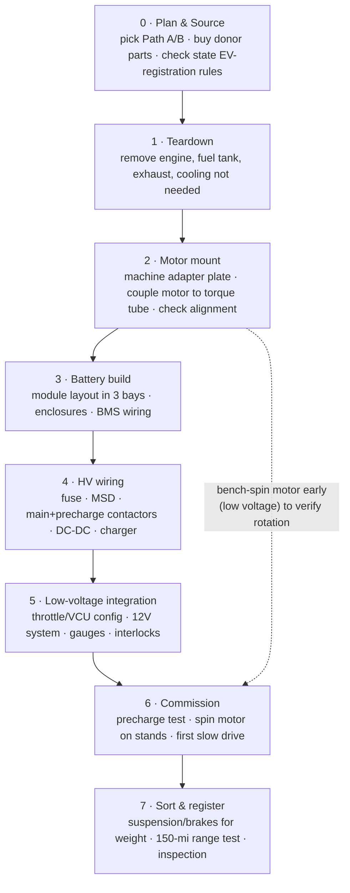

# 944 EV — Build Order (sequence & checklist)

The order that minimizes rework and keeps you safe. Rule of thumb: **prove the
mechanical fit before you build the pack, and build/test the HV safety loop before
the motor ever spins under power.**

## Phase checklist

**0 · Plan & source**
- [ ] Decide **Path A (Leaf+ZombieVerter)** vs **Path B (HyPer9 kit)** — drives the adapter design
- [ ] Source donor parts (motor, modules, controller, charger, DC-DC, contactors)
- [ ] **Check your state's converted-EV registration/inspection rules now** (weight, brakes, lighting) — before spending
- [ ] Confirm tools/space: engine hoist, welder, HV-rated gloves + insulated tools + DMM

**1 · Teardown**
- [ ] Remove engine + ancillaries; drain/remove fuel tank, lines, exhaust
- [ ] Strip cooling not needed (keep cabin heat plan); label/keep wiring you'll reuse
- [ ] Weigh the stripped car if you can — baseline for balance math

**2 · Motor mount** *(prove fit before building the pack)*
- [ ] Machine the **adapter plate** + coupler; have a shop indicate the bore concentric to the driveshaft
- [ ] Mount motor to torque tube; verify driveline runout / no bind by hand
- [ ] **Bench-spin the motor at low voltage** to confirm rotation/controller comms early

**3 · Battery build**
- [ ] Finalize module count/series config for target voltage + ~55 kWh (see charter)
- [ ] Build sealed, vented enclosures in the 3 bays (engine bay / fuel-tank bay / hatch well)
- [ ] Wire BMS to every module group; bench-check cell readings before install

**4 · HV wiring** *(the safety loop — section 6 of the diagrams doc)*
- [ ] Install HV fuse, **service disconnect (MSD)**, main + precharge contactors + resistor
- [ ] DC-DC converter → 12V system; onboard charger + charge contactor
- [ ] Crash/inertia switch + BMS in the contactor-coil circuit; HV isolated from chassis

**5 · Low-voltage integration**
- [ ] Throttle/pedal → VCU (Path A) or controller (Path B); configure & calibrate
- [ ] Restore 12V accessories, lights, brake booster (vacuum or iBooster), gauges
- [ ] Map interlocks: no torque unless BMS healthy + in "drive"

**6 · Commission** *(first power-up — methodical, PPE on)*
- [ ] **Precharge test**: confirm soft-charge then main closes; measure cap voltage
- [ ] Car on stands: spin the driveline under power, check both directions/regen
- [ ] First low-speed drive in a safe area; watch pack temps/voltages

**7 · Sort & register**
- [ ] Uprated springs/dampers for the added ~600–700 lb; recheck corner balance
- [ ] Brakes sized for new weight; bed-in
- [ ] **Range test toward the 150-mi goal**; log real Wh/mi
- [ ] State inspection / registration; document the build (wiring diagram + this doc)

## Why this order
- **Mechanical fit (P2) before pack (P3):** an adapter/alignment problem is cheap to fix
  with an empty car; agony once 600 lb of modules are installed around it.
- **HV safety loop (P4) before motion (P6):** precharge, fusing, MSD, and BMS-forced-open
  contactors are what make first power-up survivable.
- **Early low-voltage bench-spin (P2→P6 dashed):** catches wrong rotation / controller
  comms issues before they're buried behind a finished pack.
