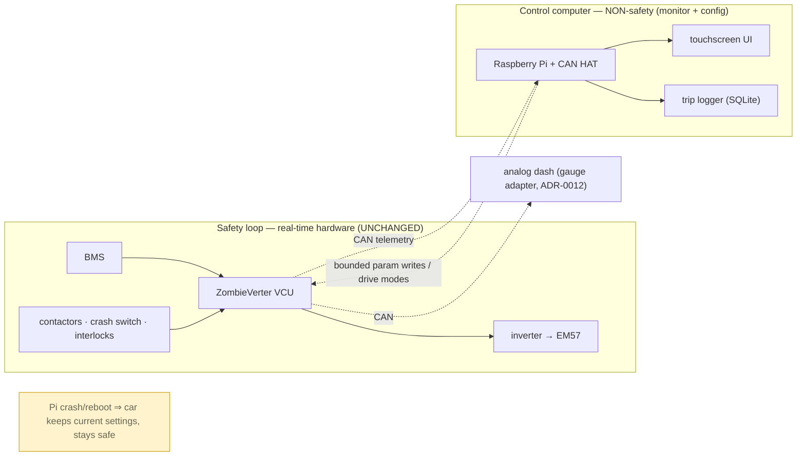

# Centralized Control & Telemetry Computer

A touchscreen **monitor + tuning console + data logger** on the openinverter CAN bus. Lets you
watch everything and pick **drive modes** / tweak parameters — **without** being in the safety
path. It's also the car's **infotainment head unit** — a custom app with **maps/navigation** and
**phone connectivity**, built as a **local web app the Pi touchscreen and your phone both run.**
Runnable dev scaffold (mock data, no car needed): **`app/`**.

## What it IS / is NOT
- **IS:** a non-safety **HMI** — reads CAN telemetry, shows it on a touchscreen, writes
  **bounded** parameter presets (drive modes) to the VCU, logs trips.
- **IS NOT:** a safety controller. It is **outside the safety loop.** The **ZombieVerter VCU +
  BMS** enforce all hard limits, interlocks, precharge/contactor logic, and charge-inhibit
  **independently and in real time.** The Pi can crash/reboot → the car stays safe and drivable.

## Architecture

Two displays, different jobs: the **analog dash** (cheap, always-on, classic daily view) and the
**touchscreen** (rich telemetry, config, logging).

## Hardware (BOM, ~$150–300 — optional enhancement, not required to drive)
| Part | Pick | ~$ |
|---|---|---|
| Brain | **Raspberry Pi 4/5** (or CM4) | $60–80 |
| CAN interface | **PiCAN2 / Waveshare 2-CH CAN HAT** (MCP2515 + transceiver) or USB-CAN | $30–50 |
| Display | official 7" DSI **touchscreen** (or sunlight-readable HDMI touch) | $60–100 |
| Power | **12 V→5 V buck**, switched on ignition, + **supercap/UPS HAT** for graceful shutdown | $20–40 |
| Storage | **SSD or read-only/overlayfs SD** (avoid corruption on power cut) | — |
| GPS | **USB gpsd dongle** (reliable in-car) | $15–30 |
| Audio/connectivity | Pi **WiFi as AP** (phone joins) + **Bluetooth** audio to the stereo | built-in |
| Enclosure/mount | console mount | $15 |

## The app (software stack)
Build it as a **local web app served by the Pi** — the **touchscreen runs it in kiosk Chromium,
and any phone on the car's WiFi opens the same app** (one codebase, instant "phone connection").
- **Backend (Python):** `python-can` over **SocketCAN** (`can0`) reads/writes the openinverter
  bus; serves telemetry + a drive-mode/tuning API. **Dev: a mock CAN source** runs it on a laptop
  with no car — see **`app/`** (`python3 app/backend/server.py`).
- **Frontend (web / PWA):** telemetry gauges + **map** + drive-mode buttons; installable on the
  phone, full-screen on the Pi.
- **Logging:** SQLite ring buffer per trip → **validates the range model** (real Wh/mi).
- **Config:** drive modes + param bounds as **JSON** (`app/drive_modes.json`), version-controlled.

## Maps & navigation
- **Offline-first:** MapLibre/Leaflet + **pre-cached OpenStreetMap tiles** on the SSD, so maps
  work with **no signal**. Car position from the **gpsd** GPS dongle.
- **Live optional:** route/traffic via the **phone's hotspot** when you want it.
- Turn-by-turn via a routing engine (OSRM/Valhalla) or hand off to the phone.

## Phone integration
- **Companion view:** the phone joins the **Pi's WiFi AP** and opens the **same web app** — a
  passenger screen or a remote glance at SOC/telemetry. No separate app to build.
- **Media/calls:** phone audio over **Bluetooth** to the stereo (reuse the head unit/amp).
- **Tethering:** the phone's hotspot gives the Pi internet for live maps/traffic.
- *(Alternative: run **OpenAuto/Crankshaft** for full Android-Auto projection — but it competes
  with the custom app; we keep ours primary.)*

## Drive modes (presets — just parameter sets)
| Mode | Power/torque | Regen | Throttle | Use |
|---|---|---|---|---|
| **ECO** | limited | max | gentle | range |
| **NORMAL** | ~full | medium | linear | daily |
| **SPORT** | full | low | sharp | fun |
| **VALET** | very low + speed cap | medium | gentle | hand it over |
| **CUSTOM** | user-set | … | … | tinker |

Switching writes the preset's params to the VCU (some only at standstill). **The VCU still
clamps everything to its hard safety limits** — a mode can't exceed them.

## Tunable parameters (examples, each with a UI-enforced safe min/max)
throttle deadband + curve · max motor torque · max motor current · **regen strength** +
one-pedal blend · torque ramp up/down · **creep** on/off + torque · field weakening / max RPM ·
**speed limit** (valet) · temperature-derate thresholds. *Safety-critical params (contactor
logic, BMS limits) are **not** writable from the HMI.*

## Telemetry screens
- **DRIVE:** speed · kW · SOC · range · motor/inverter temp · active mode.
- **BATTERY:** pack V/A · SOC · cell min/max/spread · pack temp.
- **POWER:** live kW in/out · **Wh/mi** (instant + trip) · efficiency.
- **DIAG:** faults · contactor state · 12 V · CAN health.
- **TRIPS:** history + export (range-model validation).

## Safety & security boundary (non-negotiable)
- **Non-safety-rated.** All hard limits + interlocks stay in the **VCU + BMS + hardware**
  (`../SECURITY.md`, `control-wiring.md`). Pi failure ⇒ car keeps current settings, stays drivable.
- **Bounded writes only** — the HMI can't command anything outside safe ranges; can't touch
  contactor/BMS safety logic.
- **Standstill-gate** drive-affecting changes where appropriate.
- **Keep it offline** — no inbound network to a computer on the drivetrain CAN (attack surface).
  Phone mirroring = read-only/local. **Watchdog** + read-only FS for reliability.

## Why this is worth building
Live monitoring, switchable drive modes, real tuning, and **trip logging that proves out the
range/efficiency model** — all on a custom screen, while the classic analog dash keeps the soul.

> Decision: `adr/0014` · CAN context: `power-and-reuse-diagrams.md` · control: `control-wiring.md`.
