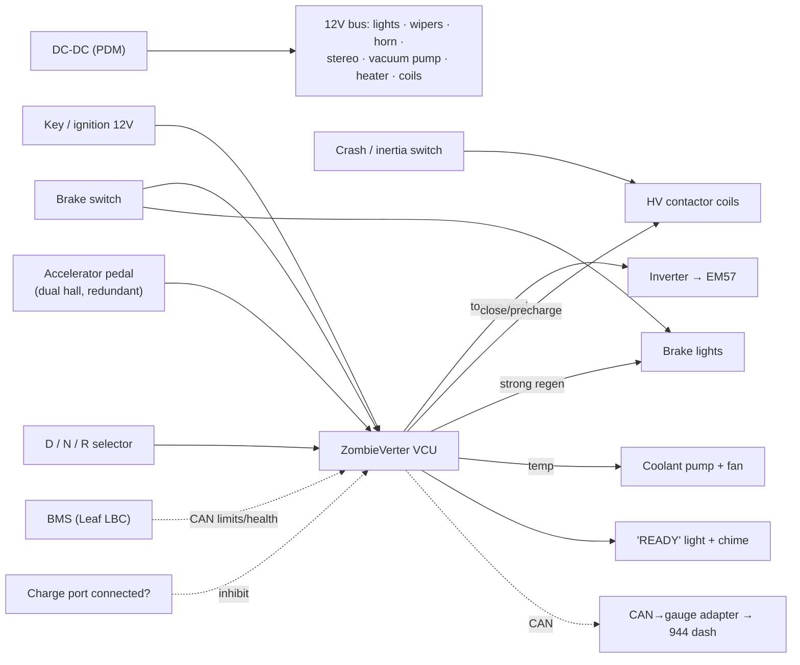

# Control & Low-Voltage Wiring — pedals, brakes, gear, interlocks

The HV side *moves* the car (`drivetrain-diagrams.md` §6); this is the **12 V signal side** that
tells it what to do — safely. Almost everything here is logic into the **ZombieVerter VCU**.

## Accelerator pedal
- **Reuse the donor Leaf pedal** — it's a **dual hall-effect** sensor (two signals + 5 V + gnd).
- Both signals → VCU; the VCU **cross-checks them and faults safe** if they disagree (a stuck/
  shorted pedal can't command runaway torque).
- VCU **pedal map**: deadband, max torque, and lift-throttle **regen** blend.

## Brakes — three separate jobs
1. **Boost:** no engine vacuum anymore → **electric vacuum pump + reservoir + vacuum switch**
   (pump cycles to hold vacuum), or a Bosch **iBooster**.
2. **Brake lights:** brake-pedal switch → stock 944 brake lamps **and** a VCU input.
3. **Regen:** brake (or lift-throttle) tells the VCU to apply regenerative braking.
   ⚠️ **Strong regen must light the brake lamps** — wire the VCU to trigger them above a decel
   threshold (required in many regions, and just safe).

## Gear selector — D / N / R is ELECTRONIC
- The transaxle stays in **one gear**; **reverse = the motor spinning backward.** So you need a
  **D/N/R selector** (reuse the 944 shifter position, or a rotary/toggle) → VCU direction input.
- **Reverse enabled only at standstill.** Park = the 944's **mechanical handbrake** (kept).

## Key / start sequence
Key 12 V → VCU wakes → checks BMS + interlocks → **precharge → main contactor → "READY".**
- ⚠️ Add a **"READY" indicator** (light + maybe a chime). The car is **silent** — you must know
  it's live before you press the pedal.

## Drive-enable interlocks (the safety core)
**No motor torque unless ALL true:**
- BMS healthy (CAN) · in **Drive/Reverse** · (recommended) **brake pressed to engage** ·
  **crash/inertia switch** closed · **charge port NOT connected** · HVIL loop intact.
- The **crash/inertia switch sits in the contactor-coil circuit** → opens HV in a crash.
- **Charge interlock:** drive inhibited while plugged in (no driving off with the cord attached).

## Cooling control
VCU (or a thermo relay) runs the **coolant pump + radiator fan** off inverter/motor temp
(reuse the Leaf pump). The kept **944 radiator** sheds the heat.

## 12 V system
- **DC-DC (Leaf PDM)** keeps the 12 V battery charged and powers **all stock loads** — lights,
  wipers, horn, gauges, **stereo + amp**, vacuum pump, heater, **contactor coils**.
- **Size the DC-DC** for simultaneous peaks (bass + pump + heater). Fuse/relay box on the 12 V side.
- **Fail-safe:** if 12 V sags, the contactors **open** (no coil power = HV disconnects).

## Heater / defrost
**Electric PTC coolant heater**, switched by the stock HVAC control via a relay — **required for
defrost** (legal/safety, no engine heat).

## Signal map
| Signal | From | To | Type | Notes |
|---|---|---|---|---|
| Accelerator | Leaf pedal | VCU | 2× analog (hall) | redundant; fault-safe |
| Brake switch | pedal switch | VCU + brake lamps | 12 V | also gates regen |
| Direction | D/N/R selector | VCU | digital | reverse @ standstill |
| Key | ignition | VCU | 12 V | wake + start sequence |
| BMS health/limits | BMS (LBC) | VCU | CAN | torque/charge limits |
| Crash switch | inertia switch | contactor coil | 12 V series | opens HV in a crash |
| Charge interlock | charge port pilot | VCU | digital | inhibits drive |
| Coolant temp | EV-loop sender | VCU / gauge | analog | runs pump + dash |
| Pump/fan | VCU/relay | pump, fan | 12 V out | thermal |
| Brake-light (regen) | VCU | brake lamps | 12 V out | on strong regen |
| READY | VCU | dash light/chime | 12 V out | silent-car cue |
| Gauges | VCU | CAN→gauge adapter | CAN | dashboard (ADR-0012) |

## Wiring diagram (low-voltage control)

---

## Details we hadn't fully considered (now flagged)
| Detail | Status | Action |
|---|---|---|
| **Reverse = electronic** (D/N/R selector) | ✅ covered here | add selector to BOM |
| **Regen → brake-light trigger** | ✅ covered | wire VCU output to lamps |
| **Drive-enable interlocks + charge inhibit** | ✅ covered | wire the interlock chain |
| **"READY" indicator** (silent car) | ✅ covered | add light/chime |
| **Power steering** — if your 944 has **hydraulic** PS, the engine-driven pump is gone | ⚠️ **DECIDE** | electric PS pump (e.g. MR2/Astra column) *or* accept manual-effort steering |
| **Creep** (auto-like crawl from stop) | ⚠️ decide | VCU-configurable — on or off? |
| **Hill-hold** | ⚠️ decide | VCU feature or just the handbrake |
| **Speedometer source** (cable vs VSS vs CAN) | ⚠️ verify on car | confirm 944 speedo drive works |
| **DC-DC sizing** for stereo+pump+heater peaks | ⚠️ size it | confirm PDM headroom |
| **Shutdown sequence** (key-off → open contactors → bleed) | ✅ standard | VCU handles |
| **HVIL** on HV connectors | recommended | low-V loop drops contactor if a connector opens |

> Related: HV side `drivetrain-diagrams.md` §6 · power flow `power-and-reuse-diagrams.md` ·
> dash `dashboard-reuse.md` · safety `../SECURITY.md`.
