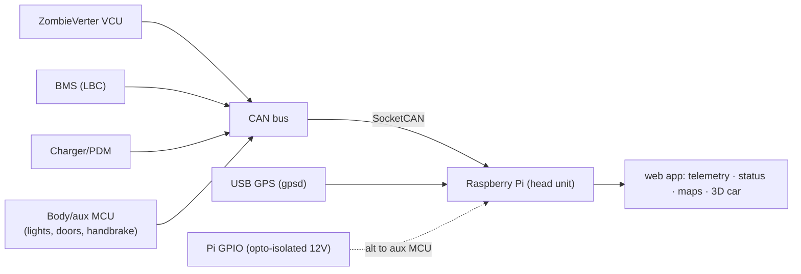

# Data Sources — what the head unit reads (and why not OBD2)

## The OBD2 answer, up front
- The **1987 944 predates OBD-II** (mandated 1996) — it has **no OBD port.**
- And we're **removing the engine + its DME entirely**, so there's no engine ECU to query anyway.
- **OBD2 is not how we get data.** The EV drivetrain speaks **CAN** (openinverter), which is
  *richer* than OBD2 — full pack/motor/inverter telemetry natively. That's what the SocketCAN
  reader (`app/backend/can_source.py`) consumes.
- *(If you ever wanted a generic OBD2 port for a scan tool, you'd add an adapter that re-publishes
  CAN as OBD2 PIDs — but it's unnecessary here.)*

## What the real controllers give us
| Source | Bus | Signals |
|---|---|---|
| **ZombieVerter VCU + inverter** | CAN | motor RPM, torque/current, motor temp, inverter temp, DC bus V, throttle %, drive state, faults, contactor states |
| **BMS (Leaf LBC)** | CAN | pack V, pack A, SOC, cell min/max/spread, pack temp, charge/discharge limits, BMS faults |
| **Charger / PDM** | CAN | charge state, AC input, charge power |
| **GPS (gpsd dongle)** | USB | position, GPS speed, heading |
| **Body / comfort** | digital 12 V | headlights, turn signals, brake light, handbrake, doors, charge-port connected, ignition |
| **Derived (computed)** | — | range, Wh/mi, efficiency, power kW |

## Wiring it up for "all car status" — three input layers

1. **Drivetrain & battery → CAN** (SocketCAN — built): the rich stuff.
2. **Location/speed → gpsd** (USB GPS): the map + GPS speed.
3. **Body/comfort → digital inputs**: the 944's body wiring is discrete 12 V signals. Read them
   via **opto-isolated Pi GPIO**, or (cleaner) a **small microcontroller that publishes them on
   CAN** — one bus for everything. They then appear as telemetry fields like `headlights`,
   `left_turn`, `handbrake`, `door_open`, used by the status display and the 3D **CAR** view.

## How signals map into the app
Every CAN signal → a field via **`app/can_map.json`** (set to your ZombieVerter's CAN mapping).
The field names match what `MockCan` produces, so **the UI doesn't change when you switch mock →
real** — only the source. GPIO/aux signals add the body fields. Same contract end to end.

> Source code: `app/backend/can_source.py` · map: `app/can_map.json` · design: `control-computer.md`.
