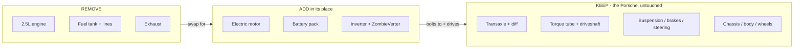
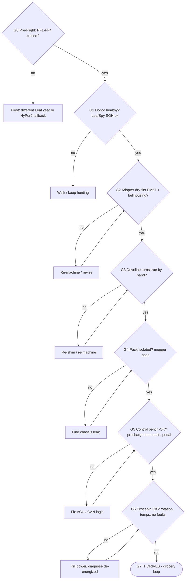
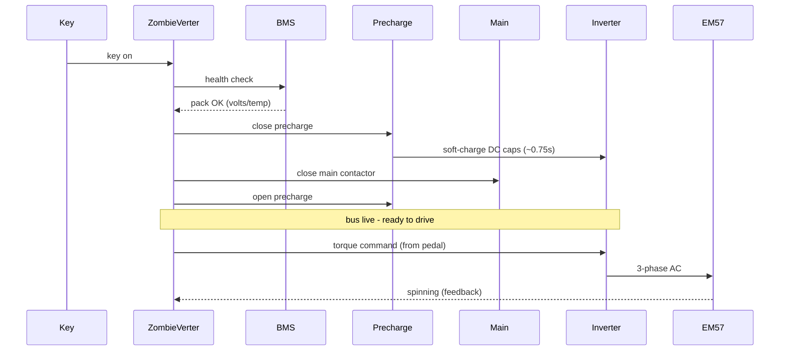
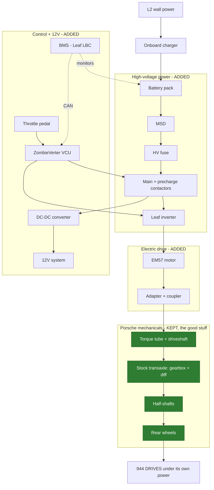
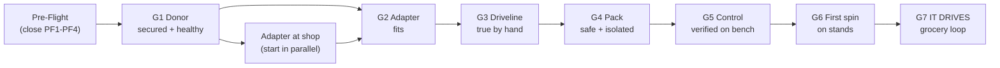

# THE DRIVE PLAN — getting the 944 to move under its own power

The single source of truth for Stage 1: the path, the gates, and the decisions that get
this car *driving*. The other docs are the detail; **this is the spine.**

---

## Visual overview — start here

### 0. The whole idea: swap the engine, keep the Porsche
This is an **engine-for-motor swap**, not a redesign. The 944's mechanicals are the asset —
we touch *one bay* and leave the great parts of the car alone.

Everything below is just *how to do that one swap safely and prove it drives.*
(Mechanical detail: `drivetrain-diagrams.md`.)

### 1. The gated path to driving (green = proceed, red = stop & fix)
Each diamond is a **falsifiable test**. You only move right when it's green; a red loops
back to a cheap fix *before* the next step builds on it.

### 2. The energize sequence (what happens at every power-up)
The precharge-then-main order is what keeps inrush from welding the contacts. This is the
choreography G5 verifies on the bench and G6 runs for real.

### 3. How everything comes together (the complete system)
Wall power charges the pack; the pack feeds the inverter through the HV safety chain; the
inverter spins the motor; the motor drives the **kept Porsche driveline** to the wheels;
the VCU + BMS orchestrate it all. Green = the original Porsche mechanicals we keep.

> Full physical/mechanical diagrams (layout, adapter, packaging, HV schematic) live in
> `drivetrain-diagrams.md`. These four are the *drive-plan* views: the swap, the gates,
> the energize sequence, and the complete system coming together.

---

## What "solid" means here (read this)
A first-time mule will have gremlins — that's reality, not a planning failure. This plan is
"solid" not because nothing goes wrong, but because:
1. **Every step ends in a falsifiable gate** (a concrete pass/fail test). You never build on
   an unverified assumption.
2. **The known unknowns are closed *before* you spend money** (the Pre-Flight below).
3. **Every top risk has a mitigation and the gate that catches it.**

If a gate is red, you stop and fix it there — cheap — instead of discovering it after 600 lb
of pack is in the car.

## Definition of "driving" (the target we're proving)
> The 944 moves under its own power on the donor Leaf pack, throttle-controlled, through the
> HV safety loop, charges from L2, and completes a **5–15 mi grocery loop**. (Registration
> trails — it does not gate "driving.")

---

## Pre-Flight — close these 4 unknowns BEFORE spending (this is what makes it solid)
These are the items I could not fully verify and that the plan's confidence depends on.
**Close all four → green-light spending. Any red → pivot now, cheaply.**

| # | Unknown to close | How to close it | If it can't be closed |
|---|---|---|---|
| **PF1** | Does **ZombieVerter support the exact donor Leaf generation** (gen1/2/3 CAN + PDM)? | openinverter wiki + forum for that year before buying the donor | Choose a supported Leaf year, or fall back to HyPer9 |
| **PF2** | **EM57 inverter capacitor spec** → correct **fuse + precharge** values | openinverter wiki / inverter datasheet | Conservative defaults + bench-measure precharge time |
| **PF3** | **EM57→944 adapter approach** is machinable + a shop will commit | 2 machine-shop quotes on the drawing; check for a prior 944 builder's design | Re-design coupler; widen shop search; budget a revision |
| **PF4** | **Safety readiness:** PPE + DC meter + de-energize procedure understood | Acquire gear; rehearse `SECURITY.md` de-energize on the donor | Do not start HV work — get the gear/training first |

> PF1–PF3 are **go/no-go before money leaves your account.** This is the difference between a
> solid plan and a hopeful one.

---

## The critical path (one line)
**Pre-Flight → Donor → Adapter → Mount → Pack → HV wiring → Bench-verify control → First spin
→ Drive.** The **adapter** is the only externally-gated item — push it first and hardest.

---

## The gate ladder (don't proceed until green)

| Gate | Pass test (falsifiable) | If RED |
|---|---|---|
| **G0 Pre-Flight** | PF1–PF4 all closed | Pivot (see table) — *before spending* |
| **G1 Donor** | Bought; **LeafSpy SOH recorded**; drivetrain intact; parts extracted + labeled | Walk from a bad pack/flood car; keep listings warm |
| **G2 Adapter fits** | Machined plate + coupler **dry-fit to EM57 and bellhousing flange** | Re-machine/revise before mounting |
| **G3 Driveline true** | Motor mounted; **turns smoothly by hand; runout in spec** | Re-shim/re-machine — do NOT proceed to pack |
| **G4 Pack safe** | Mounted to structure; **megger isolation check passes**; terminals covered | Find the leak to chassis before any power-up |
| **G5 Control bench-verified** | ZombieVerter **sequences precharge→main** and reads pedal/inverter/BMS **at low voltage** | Fix logic before connecting the full pack |
| **G6 First spin** | Precharge OK; **correct rotation; both directions + regen; temps stable; no faults** | Kill power; diagnose de-energized; ask openinverter |
| **G7 It drives** | Low-speed private drive → **5–15 mi grocery loop**; logs Wh/mi | Iterate; each issue is now isolated and cheap |

**G3 and G5 are the two gates that prevent the expensive mistakes** (building a pack around a
bad driveline; energizing a full pack onto unverified control logic).

---

## Risk register (top risks + the gate that catches each)
| Risk | Likelihood | Mitigation | Caught by |
|---|---|---|---|
| Adapter alignment / machining | **High** | Validate approach at PF3; backup shop; test-fit | G2, G3 |
| Commissioning gremlins (VCU/CAN/contactor) | **High** | Bench-verify control before full pack; openinverter community | G5, G6 |
| Donor pack weaker than hoped | Med | LeafSpy at purchase; low bar for a mule; Stage 2 replaces it | G1 |
| HV safety incident | Low/**Severe** | `SECURITY.md` protocol; isolation check; first-power-up rules | G4, G6 |
| Schedule slip (hours / lead times) | High | Realistic ~5-mo plan; batch ordering; commitments table | `stage1-plan.md` |
| Registration trails | Med | Parallel track; does not gate "driving" | — |

---

## Go / No-Go decision points
1. **After Pre-Flight (G0):** if ZombieVerter won't support the donor gen *or* the adapter
   is infeasible → **pivot before spending** (different Leaf year, or HyPer9 fallback).
2. **After G2:** adapter won't fit/true → revise; do not mount.
3. **After G5:** control won't sequence on the bench → do not connect the full pack.

These three are where a solid builder stops and thinks instead of pushing forward.

---

## Honest residual unknowns (why it's "solid," not "certain")
- **Commissioning is irreducibly variable** — G5/G6 contain it, but its *duration* is the
  widest unknown. The ~5-month expected case (`stage1-plan.md`) already accounts for it.
- **The donor is a used part** — LeafSpy de-risks the pack, but a 39-yo car + salvage EV
  always has a surprise or two. The gates localize them so they're cheap, not catastrophic.
- These are why the plan is **gated and staged**, not why it's risky.

## Anchoring
Gates are sequence-locked, not date-locked. Map them onto the `stage1-plan.md` phases; when
you pick a start month, every milestone re-anchors in one pass.

## Document map
Detail behind each step: `build-guide.md` (how) · `phase1-donor-hunt.md` (G1) ·
`hv-bom.md` (parts) · `drivetrain-diagrams.md` + `battery-pack-and-balance.md` (design) ·
`stage1-plan.md` (timeline) · **`SECURITY.md` (safety — gates G4/G6).**
