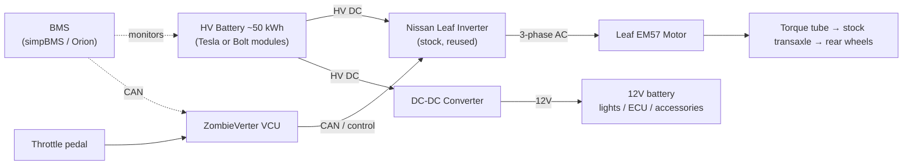
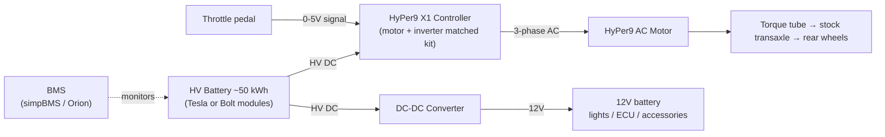

# 944 EV — Drivetrain Diagrams (Tier 2: keep the stock transaxle)

How the proposed motor + transaxle setup works. The core idea: the 944 is already
laid out perfectly for this — front "engine", a **torque tube** down the spine,
and the **transaxle (gearbox + differential) at the rear**. We pull the engine,
drop an electric motor in its place, and **reuse everything from the torque tube
back**. That's the whole Tier 2 cost saving.

---

## 1. Stock ICE drivetrain (reference — what's there now)

```
   NOSE                                                              TAIL
   ══════════════════════════════════════════════════════════════════════
    ┌──────────┐                                          ┌────────────┐
    │  2.5L I4 │                                          │ TRANSAXLE  │
    │  ENGINE  │====== torque tube (driveshaft) ==========│ 5-spd + diff│
    │ +clutch/ │        spins at engine speed             │ + clutch    │
    │ flywheel │                                          └──┬──────┬──┘
    └──────────┘                                         half-shafts
                                                         ╱          ╲
   ═══════O═══════════════════════════════════════════O═══════════════O══
       front wheels                                  L rear        R rear
                                                      wheel         wheel
```
Engine torque runs down a driveshaft **inside** the rigid torque tube to the rear
transaxle (the 944's clutch actually lives at the rear, by the gearbox). The diff
then splits power to the rear wheels. ~50/50 weight balance falls out of this.

---

## 2. Proposed EV drivetrain (Tier 2 — engine out, motor in)

```
   NOSE                                                              TAIL
   ══════════════════════════════════════════════════════════════════════
    ┌──────────┐                                          ┌────────────┐
    │ E-MOTOR  │                                          │  TRANSAXLE │
    │ HyPer9   │====== torque tube (driveshaft) ==========│  STOCK 944 │
    │  -or-    │        (unchanged, reused)               │ left in ONE │
    │ Leaf EM57│                                          │ gear (3rd)  │
    └────┬─────┘                                          └──┬──────┬──┘
      adapter                                            half-shafts
      plate + coupler                                    ╱          ╲
   ═══════O═══════════════════════════════════════════O═══════════════O══
       front wheels                                  L rear        R rear
                                                      wheel         wheel
```

**What changes:** only the front box (engine → motor) and the bolt-up between the
motor and the torque tube (the **adapter plate**, section 3).
**What stays:** torque tube, driveshaft, transaxle, diff, half-shafts, rear suspension.

Because an electric motor makes useful torque from 0 rpm across a wide range, you
**leave the gearbox in a single gear** (commonly 3rd or 4th) and effectively never
shift — no clutching needed to drive, which is why a clutchless adapter works.

---

## 3. Motor → transaxle coupling (the adapter plate — the one custom part)

There is **no off-the-shelf 944 adapter** (vendors sell 911/914, not 944), so this
plate is machined per build. It does two jobs: (a) bolt the motor face to the
torque-tube bellhousing, (b) join the motor shaft to the driveshaft, concentric.

```
     E-MOTOR                 ADAPTER PLATE            TORQUE TUBE
   ┌───────────┐            ┌───────────┐
   │           │   coupler  │ ░░░░░░░░░ │
   │     shaft ├──[≡≡≡≡≡]───┤ ░   o   ░ ├====== driveshaft ===>  to TRANSAXLE
   │           │  (splined  │ ░░░░░░░░░ │        (rear of car)
   └─────┬─────┘   hub)     └─────┬─────┘
         │                        │
   motor bolt circle        machined plate bolts to the
   mates to plate           torque-tube / bellhousing flange

   ↑ alignment is critical — a machine shop indicates the bore concentric to the
     driveshaft, or you get driveline vibration.
```

- **Path A (Leaf EM57):** motor has an integrated reduction-gear output, **not** a
  plain shaft — needs a custom coupler/adapter (more fab). Cheapest in $.
- **Path B (HyPer9):** standard 1‑1/8" keyed shaft, B-face mount — far friendlier to
  a simple plate + coupler. Bolt-on-ish, ~$4.5k more.

---

## 4. Battery placement (top-down — keeping ~50/50 balance)

~50 kWh of modules ≈ 600–700 lb. Split it to preserve balance: some in the freed-up
front engine bay, the bulk low and central where the fuel tank sat (ahead of the
rear axle).

```
            ┌─────────────────────── TOP-DOWN ───────────────────────┐
   NOSE     │  ┌────────────┐                      ┌──────────────┐   │   TAIL
            │  │ FRONT PACK │   ░░ center tunnel ░░ │  MAIN PACK   │   │
   [== motor ==│ (engine bay│   ░ torque tube  ░░ │ (low, central │═ transaxle ═]
            │  │  modules)  │   ░░░░░░░░░░░░░░░░░░ │  ahead of axle)│   │
            │  └────────────┘                      └──────────────┘   │
            └──────────────────────────────────────────────────────────┘
                 ~front axle                              ~rear axle
```
Goal: keep weight low and split front/rear so the converted car still corners like
a 944. Plan on uprated springs/dampers for the added mass.

---

## 5. Electrical system — power & control flow

### Path A — Leaf EM57 + ZombieVerter VCU + stock Leaf inverter



### Path B — NetGain HyPer9 + integrated X1 controller



**Shared HV safety plumbing (both paths, not drawn above):** main contactor +
precharge resistor + HV fuse between battery and controller, plus a service
disconnect. The charger (Leaf OBC or aftermarket) feeds the HV battery through the
BMS. These are common to every build and required before the motor turns.

---

## 6. HV wiring schematic (the safety plumbing — build this right first)

Everything between the battery and the controller exists to make the pack *safe to
connect and disconnect*. Nothing turns until this is correct.

```
   ┌──────────────────────────  HV BATTERY ~50 kWh  ──────────────────────────┐
   │  [mod]-[mod]-[mod] ─── [MSD] ─── [mod]-[mod]-[mod]                        │
   │   +                service disconnect                  -                  │
   │                  (manual midpack split)                                   │
   └────┬────────────────────────────────────────────────────────┬───────────┘
        │ HV+                                                      │ HV−
        │                                                          │
    [HV FUSE]                                                      │
        │                                                          │
        ├───────────────────────┐                                 │
        │                        │ precharge branch                │
   [MAIN CONTACTOR]      [PRECHARGE CONTACTOR]+[RESISTOR]          │
        │                        │  (charges inverter caps         │
        │◄───────────────────────┘   before main closes)           │
        │ switched HV+                                             │ HV−
        ▼                                                          ▼
   ┌──────────────────────────────────────────────────────────────────┐
   │     CONTROLLER / INVERTER   (HyPer9 X1  ·or·  Leaf inverter)       │
   └───────┬──────────────────────────────────────┬───────────────────┘
           │ 3-phase AC                            │ HV tap
           ▼                                       ▼
      [E-MOTOR]                            [DC-DC CONVERTER] ──12V──▶ 12V batt
                                                                     + all car
                                                                     accessories

   CONTROL / PROTECTION (low-voltage side):
   ┌─────┐  monitors cell V/temp        commands open on fault
   │ BMS │──────────────▶ pack ─────────────────▶ [MAIN + PRECHARGE CONTACTORS]
   └──┬──┘                                          ▲
      │ enable / interlock                          │ ignition key + inertia switch
      └─────────────────────────────────────────────┘  in series with contactor coil

   CHARGING:
   wall AC ──[J1772 EVSE]──▶ [ONBOARD CHARGER] ──HV──▶ [CHARGE CONTACTOR] ──▶ pack +
                                   ▲
                                   └── BMS tells charger to taper/stop at full & balance
```

**Sequence to energize:** key on → BMS healthy → precharge contactor closes
(resistor gently charges the inverter capacitors) → main contactor closes →
precharge opens → ready to drive. The HV fuse and the manual **service disconnect
(MSD)** let you make the pack inert for any work on it.

**Non-negotiables:** one HV fuse sized to the pack, a contactor that the BMS can
*force open*, an inertia/crash switch in the contactor-coil circuit, and the MSD.
These are identical for Path A and Path B.

---

## 7. Physical packaging in the 944 (where the modules actually go)

The 944 gives you three usable volumes. Keep modules **low** and **split front/rear**
so the car still balances.

```
   ┌──────────────────────── SIDE VIEW ────────────────────────┐
   │  frunk/    engine bay      cabin        fuel-tank    hatch │
   │  nose      (motor + some                bay (under   cargo │
   │            front modules)               floor, ahead  +    │
   │                                         of rear axle) spare │
   │                                                       well │
   │   ┌──┐    ┌──────────┐                  ┌────────┐  ┌────┐ │
   │   │  │    │ MOTOR    │                  │ MAIN   │  │REAR│ │
   │   │  │    │ +[mods]  │   ░torque tube░  │ PACK   │  │mods│ │
   │   └──┘    └──────────┘                  │ (low)  │  └────┘ │
   │ ──O────────────────────────────────────┴────────┴──O───── │
   │   front axle                                  rear axle    │
   └───────────────────────────────────────────────────────────┘

   ┌─────────────────────── TOP-DOWN ──────────────────────────┐
   │   ┌───────────────┐                    ┌────────────────┐  │
   │   │ FRONT BOX     │   ░░ tunnel ░░░░░  │  MAIN BOX      │  │
   │ [=│ engine-bay    │   ░ torque tube ░  │  fuel-tank bay │=transaxle
   │   │ modules + DC- │   ░░░░░░░░░░░░░░░  │  + hatch/spare │  │
   │   │ DC, contactor │                    │  well modules  │  │
   │   └───────────────┘                    └────────────────┘  │
   └────────────────────────────────────────────────────────────┘
```

**The three volumes:**
1. **Engine bay (front):** biggest single space, freed by pulling the 2.5L. Holds the
   motor + a front module group + the DC-DC and contactor/precharge box.
2. **Fuel-tank bay (mid/low, ahead of the rear axle):** the prime spot — low and
   central, so weight here barely moves the balance. The stock tank comes out.
3. **Hatch cargo floor + spare-tire well (rear):** trim/top-up capacity; watch that
   rear-biasing weight here is balanced by the front group.

**Packaging notes:**
- **Tesla 5.3 kWh bricks** are uniform and stack predictably into these boxes; **Bolt**
  is cheaper per kWh but comes as one big pack that's harder to split across three
  volumes — a real tradeoff, not just a price difference.
- Build sealed, vented **steel/aluminum enclosures**; isolate HV from the chassis;
  keep the MSD reachable.
- Net added mass ~600–700 lb → uprated springs/dampers (already in the budget).

---

### Reading guide
- **Mechanical** (sections 1–4): the motor sits where the engine was; everything
  from the torque tube back is stock 944, gearbox left in one gear.
- **Electrical** (section 5): battery → controller/inverter → motor; a VCU (Path A)
  or the kit controller (Path B) turns the throttle pedal into motor torque; a
  DC-DC keeps the normal 12V car alive.
- **HV safety** (section 6): fuse + contactor + precharge + service disconnect +
  BMS-forced-open + crash switch — build and test this before the motor ever turns.
- **Packaging** (section 7): three volumes (engine bay, fuel-tank bay, hatch/spare
  well); keep modules low and split front/rear for ~50/50 balance.
