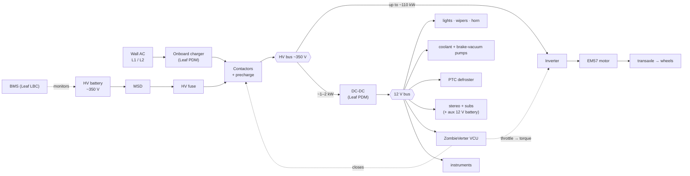
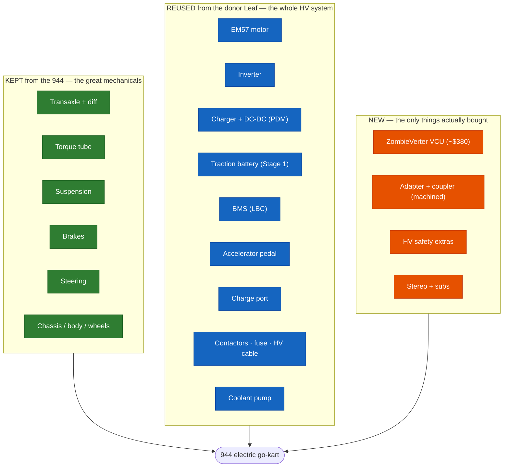

# Power Distribution & Hardware Reuse

How power flows through the converted car, and — the part that makes this plan elegant — how
little of it is actually *new*. You're re-animating a 944 with a wrecked Leaf's organs.

---

## 1. Power distribution (where the watts go)
The HV battery feeds one bus; that bus splits into **traction** (the big load) and a **DC-DC**
tap that runs the whole 12 V car. The charger feeds the bus from the wall.

**Reading it:** ~99% of the power goes to traction (up to ~110 kW); everything else in the car
sips ~1–2 kW through the DC-DC. The VCU is the brain — it turns the pedal into inverter torque
and sequences the contactors; the BMS guards the pack.

---

## 2. Hardware reuse map (944 · donor Leaf · new)
Green = kept from the Porsche. Blue = reused from the donor Leaf. Orange = the *only* new parts.

---

## 3. Reuse scorecard
| Source | What it provides | Cost |
|---|---|---|
| **Kept from the 944** | transaxle, torque tube, suspension, brakes, steering, chassis, wheels, HVAC, lights | **$0** |
| **Reused from the donor Leaf** | motor, inverter, charger, DC-DC, battery, BMS, pedal, charge port, contactors, fuse, cable, coolant pump | **one donor (~$2.5–4.5k)** |
| **New (bought)** | ZombieVerter VCU, custom adapter + coupler, a few HV safety extras, stereo | **~$1–1.5k** |

**The punchline:** the entire high-voltage powertrain is **two donors deep in reuse** — the
Porsche gives the rolling chassis and the transmission of power; the Leaf gives the *entire*
electrical drivetrain, pre-matched. The only genuinely **new electronics is a ~$380 control
board** (ZombieVerter), and the only **new fabrication is one adapter.** Everything else is a
second life for parts that were headed for scrap.

> That's the whole spirit in one picture: **two cars that were each "done" — a 944 with a dead
> engine and a Leaf with a dead body — become one car that drives.**

Power flow detail: `drivetrain-diagrams.md` §5–6 · System integration: `drive-plan.md` ·
What's removed: `strip-list.md`.
