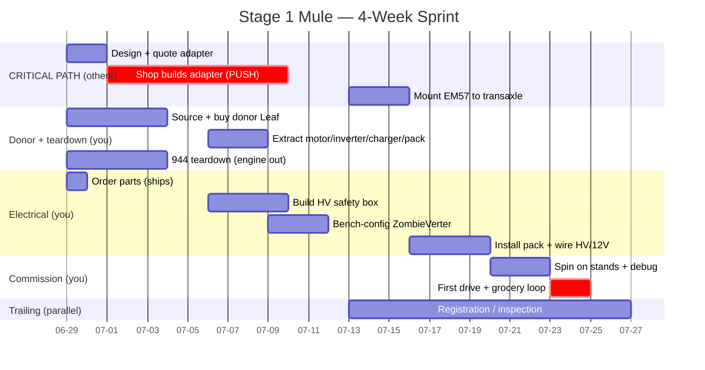

# Stage 1 Mule — 4-Week Sprint Plan

A **forcing-function timeline**: aggressive, dated, and built to hold *other people* to
commitments — the machine shop, the donor seller, the parts vendors. Hit the dates by
making them hit theirs.

**Assumptions** (from calibration): ~20–30 hrs/week hands-on · adapter **outsourced** to a
machine shop · fully equipped shop (hoist, welder, HV PPE/meter).

**Anchor:** Day 1 = **Mon 2026-06-29** → driving-mule target **Fri 2026-07-24**, first
grocery loop that weekend. (Shift the anchor if you start later; keep the *durations*.)

---

## The one hard truth: the adapter gates everything
The custom EM57→torque-tube adapter is **outsourced**, so the schedule is only as fast as
the shop. **Everything else can be done in ~3 weeks of part-time work; the adapter is the
only thing you don't control.** So you protect the date by:
1. Designing + quoting it in the **first 48 hours**.
2. Handing the shop a **hard due date (≤9 days)** and getting them to commit to it.
3. Having a **backup shop** quoted in case shop #1 says "3 weeks."

If no shop will commit to ≤2 weeks, the 4-week target moves — better to know on Day 2 than Day 20.

---

## First 48 hours — the timeline-protecting moves (do these before anything fun)
- [ ] **Adapter:** finalize the drawing, send to 2 machine shops, get quotes + lead times. Pick the one that commits to **due ≤ Fri Jul 10**.
- [ ] **Donor:** find + commit to a salvage Leaf; set a **pickup date ≤ Sat Jul 4**.
- [ ] **Order electronics same day:** ZombieVerter VCU, main contactor, precharge resistor, HV fuse, MSD, 2 AWG cable + lugs. (Shipping is its own lead time — start the clock.)

> These three are all **other-people dependencies**. Push them now; they're what slips.

---

## Sprint Gantt

---

## Week by week (dated milestones)

### Week 1 · Jun 29 – Jul 5 — *Commit the dependencies, strip the car*
**Tracks run in parallel.**
- **You:** Pull the engine, fuel tank, exhaust. Weigh the stripped car (balance baseline). Buy + collect the donor Leaf; extract EM57, inverter, charger, **battery**, harness.
- **Others (push):** Adapter in a shop with **due Jul 10**. Electronics ordered Day 1 and shipping.
- **🏁 Milestone (Jul 5):** Engine out · donor parts in hand · adapter in the shop · electronics en route.

### Week 2 · Jul 6 – Jul 12 — *Build the electrical, adapter inbound*
- **You:** Build the HV safety box (contactor, precharge, fuse, MSD on a plate). Bench-config the ZombieVerter against the Leaf inverter (firmware, throttle map). Mock up donor-pack location + DC-DC + 12V.
- **Others (push):** Adapter **delivered Jul 10**. If it's late, escalate or pull the backup shop *now*.
- **🏁 Milestone (Jul 12):** HV box built · VCU configured · adapter in hand.

### Week 3 · Jul 13 – Jul 19 — *Integrate*
- **You:** Mount EM57 to the transaxle via the adapter; check driveline alignment. Install donor pack + HV box; wire the HV loop, charger, DC-DC, throttle, 12V, brake booster.
- **Parallel:** Start the registration/inspection paperwork (it trails — begin now).
- **🏁 Milestone (Jul 19):** Motor mounted · car wired · ready for first power-up.

### Week 4 · Jul 20 – Jul 26 — *Commission & drive*
- **You:** Precharge test → on-stands spin (both directions, regen). Fix what shows up (budget real debug time here — this is where mules bite). First low-speed drive in a safe area, then the **grocery loop**.
- **🏁 Milestone (Jul 24):** Drives under its own power. **(Jul 25–26): first grocery run.**

---

## Commitments to extract from others (your push list)
Hold these parties to *their* dates and your date holds.

| Party | Commitment to get | Due | If they slip |
|---|---|---|---|
| Machine shop | Adapter built to drawing | **Fri Jul 10** | Pull pre-quoted backup shop; offer rush fee |
| Donor seller | Leaf available for pickup | **Sat Jul 4** | Have a 2nd donor listing lined up |
| Parts vendors | ZombieVerter + HV bits shipped | **ships Jun 29** | Pay for expedited; source contactor/fuse locally |
| DMV / inspector | Converted-EV requirements + slot | **ask Week 3** | Drive on private property until cleared |

---

## Slip plan (know the failure modes)
- **Adapter late** → the whole date moves. *Mitigation:* hard due date + backup shop quoted Day 2. This is 80% of your schedule risk.
- **Commissioning debug overruns** (wrong rotation, VCU comms, HV gremlins) → *Mitigation:* the early bench-config (Week 2) and on-stands spin (Week 4) surface these before they're buried.
- **Registration trails past Jul 26** → *Mitigation:* it's parallel and partly out of your hands; the *driving* milestone doesn't depend on it. Grocery-loop on private property until the paperwork clears.
- **Hours dip below ~20/wk** → Week 4 commissioning is the buffer that compresses or extends.

## Stage 1 = done when (target Jul 24–26)
- [ ] EM57 on the stock transaxle via the adapter; spins on stands under power
- [ ] Running on the donor Leaf pack through the HV safety loop
- [ ] Charges (Leaf OBC); drives a ~5–15 mi grocery loop
- [ ] (Trailing) registered/inspected for public road use
