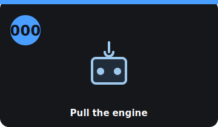

# Step 000 — Pull the engine

<!-- stepcard -->

**Phase:** NOW · **Task:** #8 · **Cost:** $0 (net positive — you'll sell the parts)
**Blocked by:** nothing — *this is where the project starts.*
**Blocks:** 002, 004, 007→009

## Do
- [ ] Disconnect the 12 V battery; relieve fuel pressure; drain coolant + fuel.
- [ ] Strip and set aside **to sell**: engine, intake, exhaust, ECU, fuel system, alt/starter/AC.
- [ ] Separate the engine from the torque tube at the bellhousing; hoist it out.
- [ ] Remove the fuel tank + lines.
- [ ] **Measure** the front bay, the fuel-tank bay, and the torque-tube flange; photograph with a ruler.
- [ ] **Weigh** the stripped car (balance baseline).

## Done when
Engine + fuel + exhaust are out, the torque-tube flange is measured/photographed, the bays
are measured, and the stripped car is weighed.

## Refs
`../docs/build-guide.md` §2A · `../docs/strip-list.md` · `../docs/parts-inventory.md`

## Notes
- 39-year-old fasteners fight back — soak with penetrant first.
- These measurements turn every schematic into real numbers — don't skip them.

<!-- tips-v1 -->

## Tools
- Engine hoist + load leveler
- Transmission/floor jack + stands
- Metric sockets + breaker bar + penetrant
- Fuel-safe drain pans + approved gas cans
- Zip-top bags + painter's tape + Sharpie
- Phone camera + a ruler/tape
- Bathroom or corner scales (weigh it)

## Time & difficulty
2–3 days · moderate

## Tips & gotchas
- 944 engine lifts out the **top** with the hood removed — give yourself overhead room.
- **Keep the torque tube + transaxle in the car** — you're reusing them. Separate only at the bellhousing.
- Label every connector with tape + a photo *before* unplugging; bag bolts per assembly.
- Cap the open torque-tube/bellhousing so nothing falls in.
- Shoot the torque-tube flange and both bays **with a ruler in frame** — those photos become your CAD dims.

## Avoid
- Nicking or prying on the torque-tube flange (your adapter registers off it).
- Losing the bellhousing dowel pins — they set alignment.
- Draining fuel near any spark/heat source.
