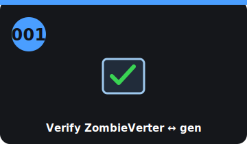

# Step 001 — Verify ZombieVerter ↔ Leaf generation (PF1)

<!-- stepcard -->

**Phase:** NOW · **Task:** #1 · **Gate:** PF1 · **Cost:** $0
**Blocked by:** nothing
**Blocks:** 005 (buying the donor)

## Do
- [ ] On the openinverter wiki + forum, confirm **ZombieVerter supports the exact Leaf year**
      you intend to buy (gen1/2/3 differ in CAN + PDM).
- [ ] Confirm it also reads that generation's **LBC** (for the Stage-1 BMS).

## Done when
You've confirmed a specific Leaf year/generation is ZombieVerter-supported — your donor target.

## Refs
`../docs/phase1-donor-hunt.md` · ADR-0001 / ADR-0007

## Notes
- **Do this before buying a donor.** Getting this wrong *after* purchase is the most painful slip.
- Default target: **2013–2017 EM57** (best-documented + cheapest).

<!-- tips-v1 -->

## Tools
- openinverter.org forum login
- The donor's year/generation (or VIN)
- ZombieVerter wiki/manual

## Time & difficulty
1–2 hrs · easy (research)

## Tips & gotchas
- **Gen-2 (2018+ ZE1) is the target** — ZombieVerter runs its inverter+motor *and* the charger/DC-DC (PDM). Gen-1 = inverter+motor only.
- Confirm the exact firmware supports your PDM before relying on the onboard charger.
- Search the forum for someone running your exact gen — copy their config.

## Avoid
- Buying a Gen-1 donor and expecting to reuse the charger.
- Assuming all 'Leaf motors' are the same generation.
