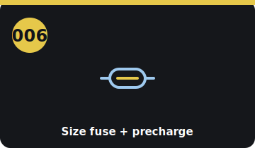

# Step 006 — Size the fuse + precharge (PF2)

<!-- stepcard -->

**Phase:** BUY · **Task:** #2 · **Gate:** PF2 · **Cost:** $0 (research)
**Blocked by:** 005 (know the exact inverter), or do from the wiki anytime
**Blocks:** 008 (ordering the HV fuse + precharge)

## Do
- [ ] Get the **EM57 inverter capacitor spec** (openinverter wiki / datasheet).
- [ ] Size the **precharge resistor** (RC vs the cap bank — ~100 Ω/100 W default) and the
      **DC-rated main fuse** (~250–300 A, ≥500 V) to your pack current.

## Done when
You have specific, justified fuse + precharge values to order against.

## Refs
`../docs/hv-bom.md` · `../docs/parts-shopping-list.md`

## Notes
- **Don't order the fuse/precharge until this is closed** — they're sized to *your* inverter.
- DC-rated fuse only — an AC fuse won't interrupt a DC arc.

<!-- tips-v1 -->

## Tools
- Pack + inverter datasheets
- Inrush/precharge calculator (or the formula)

## Time & difficulty
1–2 hrs · moderate

## ⚠ Safety
- Fuse + precharge are your HV fault protection — size them right.

## Tips & gotchas
- Main fuse just **above** the system's max continuous current, **below** the wiring/pack limit — use a proper HV fuse (e.g. Bussmann).
- Size the **precharge resistor** to limit inrush into the inverter caps (RC to ~95 % in <1 s), then the main contactor closes.
- Confirm **contactor coil voltage + contact rating** vs your pack.

## Avoid
- A fuse rated way over the wiring (won't protect it) or barely over draw (nuisance trips).
