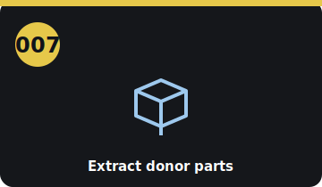

# Step 007 — Extract & label donor parts (G1)

<!-- stepcard -->

**Phase:** BUY · **Task:** #6 · **Gate:** G1 · **Cost:** $0 (labor)
**Blocked by:** 005 (have the donor)
**Blocks:** 009, 011

## Do
- [ ] **De-energize the donor first** — pull its service disconnect, wait, verify dead (`../SECURITY.md`).
- [ ] Extract + label: **EM57 motor, inverter, PDM (charger+DC-DC), traction battery, LBC,
      accelerator pedal, charge port, HV cables, contactors/fuse, coolant pump**.
- [ ] **Photograph the harness before cutting.**
- [ ] Measure the EM57 face/shaft for the adapter (feeds 009).

## Done when
All reusable parts extracted, labeled, and stored; harness documented; EM57 measured.

## Refs
`../docs/phase1-donor-hunt.md` (extraction map) · `../docs/parts-inventory.md` (🔵 reused)

## Notes
- The battery pack is heavy — keep it level, terminals covered.

<!-- tips-v1 -->

## Tools
- Your HV PPE (step 003)
- Service-disconnect removal tools
- Labels + camera

## Time & difficulty
1 day · moderate (HV)

## ⚠ Safety
- The donor pack is LIVE at 300+ V. De-energize + verify-dead before touching HV.

## Tips & gotchas
- **Pull the HV service disconnect first**, wait, then verify-dead at the terminals.
- Keep the **LBC (BMS) + its harness + PDM + pedal + charge port together** — they're paired to the pack.
- Label and photograph every HV connector and the 12 V control wiring as you go.
- Bag the small brackets/bolts — you'll want them at mount time.

## Avoid
- Cutting any orange cable before it's confirmed dead.
- Separating the LBC from its pack (loses calibration/pairing).
