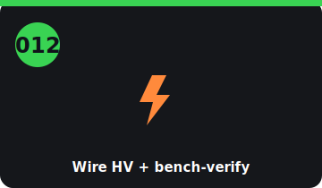

# Step 012 — Wire HV + bench-verify control (G5)

<!-- stepcard -->

**Phase:** BUILD · **Task:** #12 · **Gate:** G5 · **Cost:** (parts from 008)
**Blocked by:** 011 (pack in), 008 (parts), 003 (safety gear)
**Blocks:** 013

## Do
- [ ] Build the HV path: pack → **MSD → fuse → precharge + main contactors → inverter**.
- [ ] Crimp all 2/0 lugs (hydraulic crimper); tug-test + heat-shrink every one.
- [ ] Wire **DC-DC + charger (PDM)**, 12 V system, throttle, interlocks (BMS-healthy + crash switch).
- [ ] Configure ZombieVerter (openinverter wiki); **bench-test precharge→main + pedal at low voltage**.

## Done when
Isolation passes; control **sequences precharge→main** and reads pedal/inverter/BMS on the bench.

## Refs
`../docs/build-guide.md` §5 · `../docs/drivetrain-diagrams.md` §6 · `../docs/power-and-reuse-diagrams.md`

## Notes
- ⚠️ Build this **de-energized**. A bad crimp is a fire; verify control before the full pack is live.

<!-- tips-v1 -->

## Tools
- Multimeter
- Laptop + ZombieVerter web UI (Wi-Fi)
- candump / the head-unit DATA tab

## Time & difficulty
2–4 days · hard (HV)

## ⚠ Safety
- Bench-verify the control logic at LOW/again before full HV. One-hand rule.

## Tips & gotchas
- Wire per the **openinverter ZombieVerter diagram**; double-check contactor + precharge wiring.
- Sequence: **precharge → main contactor** (the VCU manages it — confirm it does).
- Configure the VCU over Wi-Fi; watch **opmode/faults** in the app's **TUNE/DATA** tabs.
- Verify **CAN comms** (`candump can0`) before expecting telemetry.

## Avoid
- Closing the main contactor without precharge.
- Guessing pin-outs — verify continuity first.
